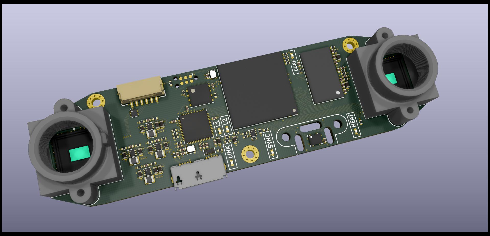
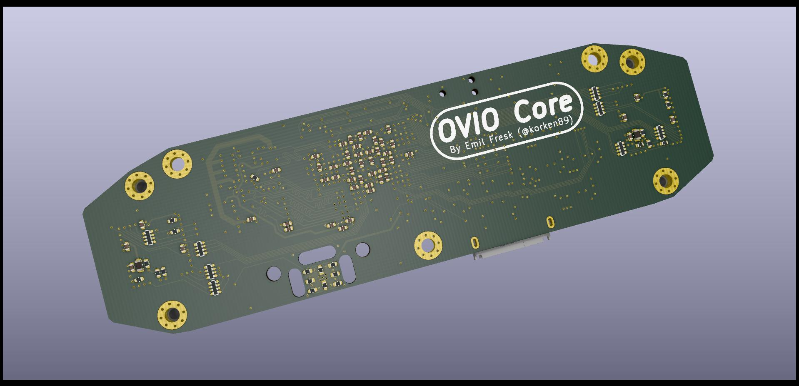

# Open Visual Inertial Odometry (OVIO) Core

**Current status: WIP (awaiting PCBs for first prototype)**

## Motivation

Aim: A "low cost" Visual Inertial Odometry accelerator.

A project to try out different vision processing pipelines, for Visual Inertial Odometry (VIO), on the ECP5 FPGA. As far as I know, the open hardware landscape of VIO cameras is slim to non-existent. Especially for systems which perform a majority of the pre-processing in the camera.

Things such as image convolutions, FAST corners, multi-scale images, non-maximum suppression, image gradients, etc, are extremely well suited for FPGA implementation.

Why do it on a PC? Let it run the actual Kalman Filter / MHE / nonlinear optimizer, which the FPGA is not well suited for.

## Specs

* Lattice ECP5U-85, design is pin-compatible to all the smaller versions
* 1 GBit DDR3 memory
* FT600 USB 3.0 FIFO with 200 MB/s transfer rate
* 2x MT9V034 cameras with tight hardware synchronization control loops (center of integration of both cameras are aligned to IMU measurements)
* Temperature stabilized ST ISM330DHC IMU (16g / 4000 dps max)

## Do you want one?

Previous projects has been made on Xilinx FPGAs, however the high cost of their FPGAs never allowed for trying to distribute a camera. Now it is expected that the hardware cost for this system should be sub 100 Euros, even with the largest ECP5 FPGA.

If there is interest for acquiring a camera, contact me (via any medium) and we'll figure something out.

## Lenses and lens holder

* http://www.m12lenses.com/2-1mm-F2-2-Board-Lens-p/pt-02120.htm
* http://www.m12lenses.com/M12-Lens-Holder-Plastic-p/pt-lh001p.htm

## Contributors

- Emil Fresk ([@korken89](https://github.com/korken89/))

## License

This hardware is open source.

TODO: Find a proper license

